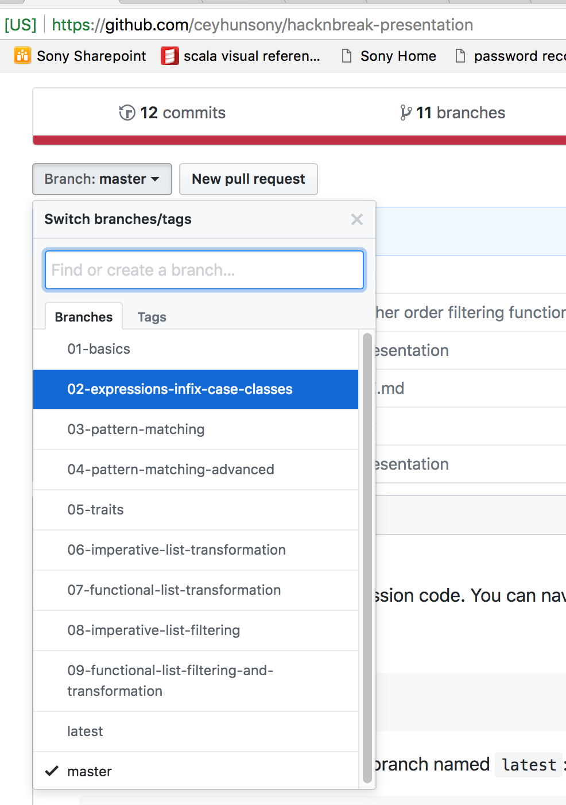

This repository contains the live-session code. You can navigate via branches.

To check which branches available:
```bash
git branch
```

To see the latest version, switch to branch named `latest`:
```bash
git checkout latest
```

In each branch go [src/main/scala/hacknbreak-session.sc](src/main/scala/hacknbreak-session.sc) to see the code at that topic.
To try those code out, you can simply use [Scastie](https://scastie.scala-lang.org/), just copy-paste the code and hit **Run**.
Make sure **Worksheet** is enabled (green dot).

If you are only browsing on github, you can use **Branch** drop-down to switch between branches.


